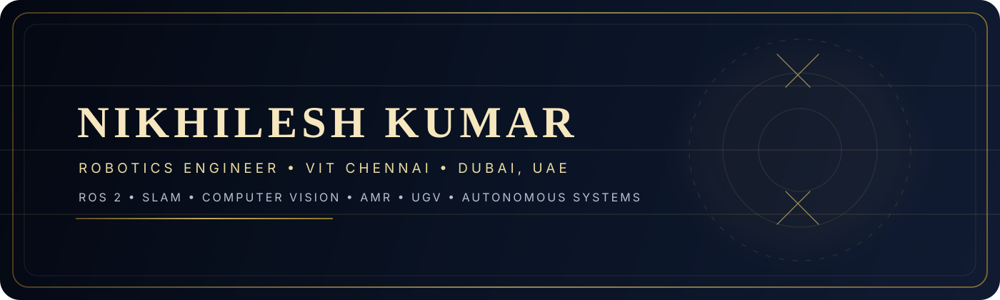

<!-- Cover: Custom SVG Banner -->


<!-- Dynamic Gold Titles (Typing Animation) -->
<p align="center">
  
</p>

---

# About Me

Hello 👋, I'm Nikhilesh Kumar — a Robotics Engineer who turns complex autonomous challenges into real-world systems. I hold a B.Tech in Mechatronics & Automation from VIT Chennai (GPA: 9.16/10) and have built and deployed robotic systems across India, Malaysia, and Dubai — from defense-grade UGVs to warehouse AMRs and medical mobile manipulators.

```python
class AboutMe:
    def __init__(self):
        self.name         = "Nikhilesh Kumar"
        self.pronouns     = "He/Him"
        self.university   = "Vellore Institute of Technology, Chennai"
        self.location     = "Dubai, United Arab Emirates"
        self.technologies = [
            "Autonomous Mobile Robots (AMR / UGV)",
            "ROS2 · Nav2 · MoveIt2 · RTABMap",
            "SLAM (2D & 3D) · Path Planning & Navigation",
            "Computer Vision · YOLOv8/v10 · OpenCV",
            "Deep Learning · CNNs · Point Cloud Processing",
            "Drone Systems (PX4 / Pixhawk)",
            "Simulation: Gazebo · Isaac Sim · RViz",
            "Embedded Systems: Raspberry Pi · Arduino · ESP32",
        ]
        self.publications  = 3   # IEEE Xplore, IET, Data-in-Brief
        self.countries     = ["India", "Malaysia", "UAE"]
        self.email         = "nikhileshkumar713@gmail.com"
```

---

# My Tech Stack

### Languages
[](https://skillicons.dev)

### Robotics & Hardware
[](https://skillicons.dev)

### AI & Computer Vision
[](https://skillicons.dev)

### Dev Tools & Infrastructure
[](https://skillicons.dev)

---

# My Stats

<p align="center">
  
  
</p>

---

# Contact Me

<p align="left">
  <a href="https://www.linkedin.com/in/nikhilesh-kumar-271783243/">
    
  </a>
  &nbsp;
  <a href="mailto:nikhileshkumar713@gmail.com">
    
  </a>
</p>
